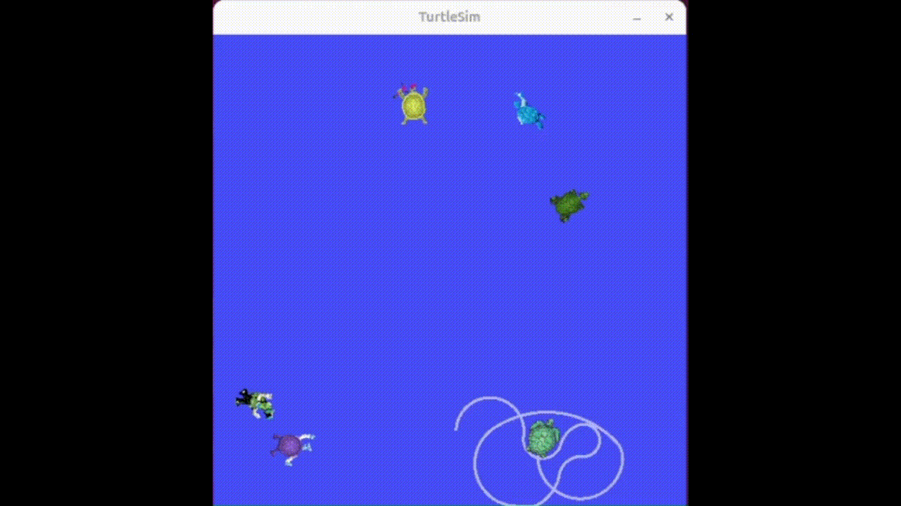

## 🐢 Turtlesim Target Hunting – Bilgilendirme

Bu proje, **ROS2** üzerinde çalışan ve popüler **turtlesim** paketi kullanılarak geliştirilmiş bir hedef avlama uygulamasıdır. Sistem, ortamda rastgele konumlarda yeni turtle'lar oluşturur ve ana turtle, kontrol algoritması sayesinde en yakın hedefi bularak ona yönelir ve yok eder.

---

### 🔍 Genel Bakış

- Ortama belirli bir sayıda yeni turtle, **`/spawn`** servisi ile eklenir.
- Ana turtle (`turtle1`), diğer turtle'ların pozisyonlarını takip eder.
- Hedef seçiminde **en yakın turtle** tercih edilir.
- Turtle hedefe doğru yönelir ve yaklaşır.
- Mesafe eşik değerin altına indiğinde **`/kill`** servisi ile hedef yok edilir.
- Tüm hedefler temizlenene kadar süreç devam eder.

---

### ⚙️ Kullanılan ROS2 Yapıları

#### **Servisler**
- `turtlesim/spawn` — Yeni turtle oluşturmak için kullanılır.
- `turtlesim/kill` — Hedef turtle'ı yok etmek için çağrılır.

#### **Mesajlar**
- `turtlesim/Pose` — Hem ana turtle’ın hem de diğer turtle'ların konum bilgilerini elde etmek için kullanılır.
- `Turtles` ve `Turtle` custom mesaj tipleri oluşturulmuştur.

#### **Kontrol Mantığı**
- Mesafe hesabı ile en yakın hedef seçilir.
- Yönelim açısı `atan2` ile hesaplanır.
- Ana turtle’ın hareketi `cmd_vel` üzerinden doğrusal ve açısal hız komutları gönderilerek sağlanır.

---

### 🔄 Sistem Akış Özeti

1. Ortama birden fazla turtle spawn edilir.
2. Ana turtle aktif hedef listesini takip eder.
3. En yakın hedefi belirler.
4. Hedefe yönelir ve yaklaşır.
5. Yeterince yakınlaştığında hedefi `/kill` servisi ile yok eder.
6. Yeni hedef belirlenir ve süreç tekrarlanır.

---

### 🎯 Amacı

Bu proje, ROS2 üzerinde:
- Servis kullanımı,
- Gerçek zamanlı pozisyon takibi,
- Basit kontrol algoritması geliştirme,
- Çoklu ajan koordinasyonu

gibi temel kavramları göstermek amacıyla oluşturulmuştur.

---

### 📷 Demo (GIF)

Aşağıdaki GIF, sistemin çalışma şeklini göstermektedir:

### Simulations

